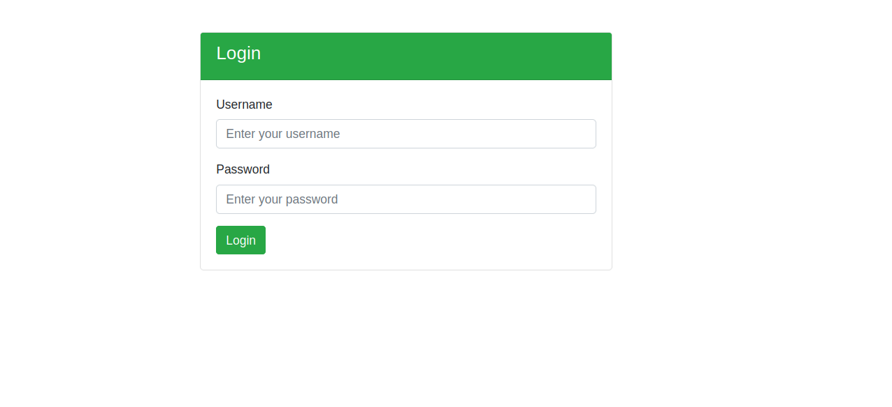
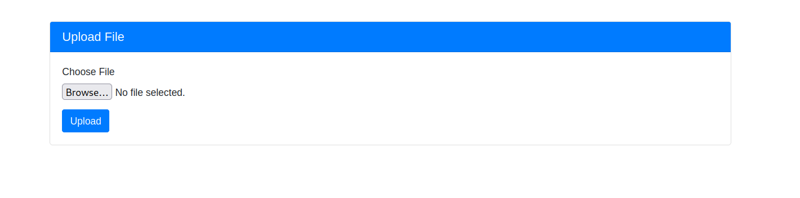
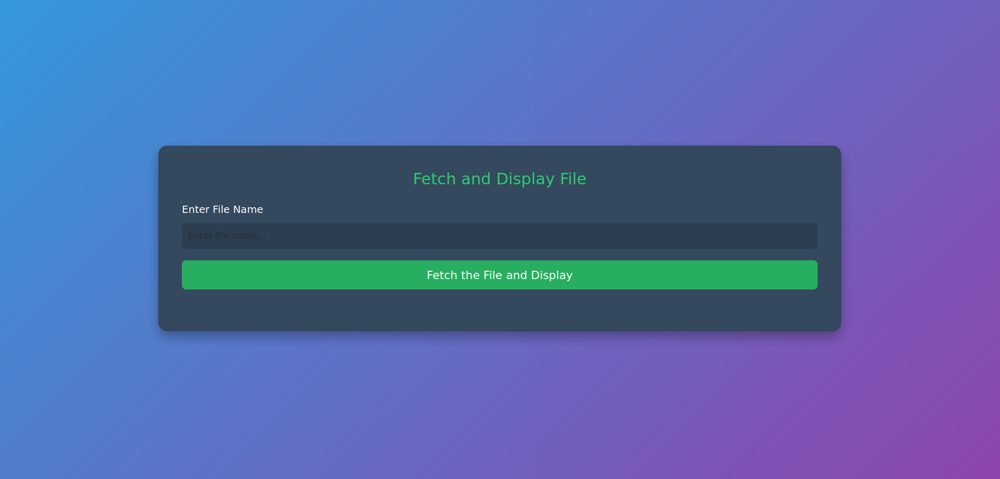
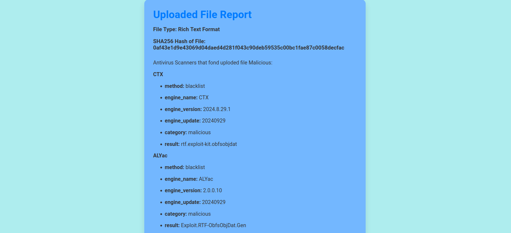

# AVGuard: Multi-Container Malware Scanning Application

### Overview

**AVGuard** is a containerized web application designed for malware scanning by utilizing the VirusTotal API. The application consists of two Docker containers:
- **Frontend Container**: Built using Django, it allows users to upload files for malware scanning.
- **Backend Storage Container**: Securely stores the uploaded files (potential malware) in an isolated environment, preventing them from affecting the frontend or the rest of the system. The uploaded files are scanned by the VirusTotal API, and the results are displayed in the frontend.

---

## Features
- **File Upload**: A simple web-based interface for uploading files.
- **Secure File Storage**: Malware files are stored separately in a dedicated Docker container for isolation.
- **VirusTotal API Integration**: The files are scanned using the VirusTotal API for malware analysis.
- **Dockerized Environment**: The entire application is containerized with separate Docker containers for the frontend and file storage.

---

## Installation Instructions

Follow these steps to set up and run AVGuard on your local machine using Docker.

### 1. Clone the Repository
Start by cloning the AVGuard repository from GitHub:

```bash
git clone https://github.com/yourusername/AVGuard.git
cd AVGuard
```

### 2. To allow the frontend and backend containers to communicate, create a Docker network.

```bash
docker network create avguard-network
```

### 3. Build and Run the Frontend (Django Application)

Navigate to the AVGuard directory and build the Docker image for the Django-based frontend. This container handles the file upload and displays the scan results.

```bash
cd AVGuard
sudo docker build -t <FRONTEND-IMAGE-NAME> .
```
Once built, run the container by linking it to the previously created Docker network.

```bash
sudo docker run -d --name <FRONTEND-CONTAINER-NAME> --network avguard-network -p 8000:8000 <FRONTEND-IMAGE-NAME>
```

### 4. Build and Run the Storage Server (Isolated Environment)

Navigate to the storage_container directory to build the Docker image for the backend container, which securely stores uploaded malware files.

```bash
cd ../storage_container
sudo docker build -t <SERVER-IMAGE-NAME> .
```
Run the backend container and connect it to the same network as the frontend.

```bash
sudo docker run -d --name <SERVER-CONTAINER-NAME> --network avguard-network <SERVER-IMAGE-NAME>
```

### 5. Access the Application

Once both containers are running, open your browser and navigate to the following URL to access the application.

```bash
http://0.0.0.0:8000/login
```
From here, you can log in, upload files, and view the VirusTotal scan results.

---

## Images









---

> **Note**: You must create your own `.env` file and add your **VirusTotal API key** to the environment variables.

### Steps to set up your `.env` file:

1. Create a `.env` file in the project root directory (same directory as `Dockerfile`).
   
```bash
touch .env
```

Inside the .env file, add the following line with your VirusTotal API key.

```bash
VIRUSTOTAL_API_KEY=your_api_key_here
```

---

> **Note**: If you encounter any bugs or issues, please report them by opening an issue on the GitHub repository.

### How to Report a Bug:

1. Go to the [Issues](https://github.com/your-repo/issues) section of this repository.
2. Click on the **New Issue** button.
3. Provide a clear and detailed description of the bug:
   - Steps to reproduce the issue.
   - Expected behavior.
   - Actual behavior.
   - Screenshots or error logs, if available.
4. Submit the issue, and we'll address it as soon as possible.

Your feedback helps improve the project!
